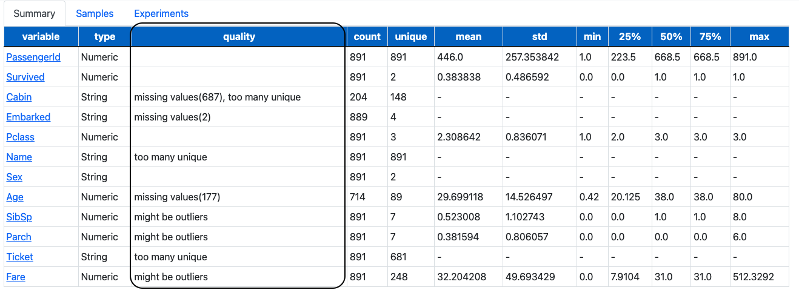
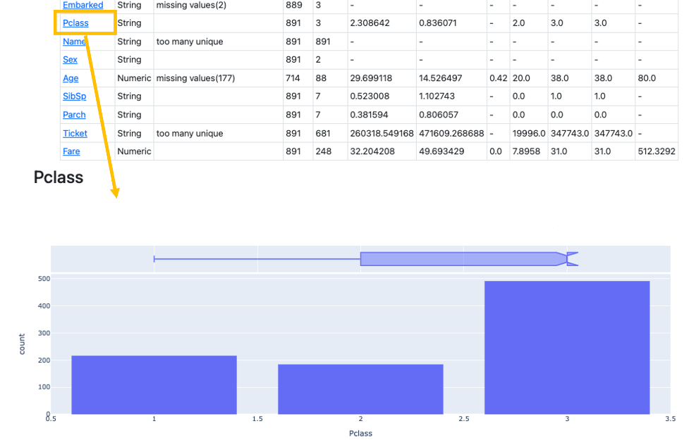

# What is AutoML?
The lack of comparison views for the output metrics that are generated by multiple machine learning (ML) models renders the determination of insights from datasets difficult for users. 
Generating ML models also requires iterative processes, covering the understanding of data to the tuning of model parameters.

AutoML EMR implements functions and storages that can accelerate the development of ML models. 
The selection of ML modeling, the modeling process itself, the user’s input, and ML modeling output are automated. 
Users can evaluate the output metrics generated by various ML models against one another in one summary view.
Output metrics help users select the most and least successful models for a given business scenario. 

# Automl EMR
Automl EMR runs AutoML functionalities on Amazon EMR. Please read the instructions in this document below.

# Why Amazon EMR?
* Scalability and flexibility
EMR is a managed service which provides flexibility to scale your cluster up or down as your computing needs change. You can resize your cluster to add instances for peak workloads and remove instances to control costs when peak workloads subside.
* AWS integration
EMR integrates with other AWS services to provide capabilities and functionality related to networking, storage, security, and so on, for your cluster. For example, S3 can store EMR input and output data.
* Deployment
EMR provides a variety of ways to configure software on users cluster as well as versions. For example, AutoML EMR applies emr-6.6.0, Hadoop 3.2.1, and Spark 3.2.0. EMR uses Amazon Linux where users can install software on users’ cluster manually using the yum or pip package manager.
* Cost savings
EMR pricing depends on the instance type and number of EC2 instances users selected. Spot or reserved instances reduce the cost.

# Output view and metrics
Users can review their uploaded CSV files in the summary view. 
Quality columns show them how input data look.
After ML modeling, area under the curve (AUC), precision, recall, and accuracy values are displayed.

# Users profile
Our target users are those who want to analyze data and have the results represented in multiple ML models.
To run the AutoML EMR application, users should download required libraries and run Python modules (see instructions in README.md).

# Data sources
Comma-separated value (CSV) files can be uploaded onto AutoML EMR. 
Users can test the application with titanic.csv (https://www.kaggle.com/c/titanic/data?select=train.csv) and heart.csv (https://www.kaggle.com/zhaoyingzhu/heartcsv?select=Heart.csv) for Spark in Local, and PS_20174392719_1491204439457_log.csv (https://www.kaggle.com/datasets/ealaxi/paysim1) for Spark on AutoML EMR, which are provided as sample data sources in the sample folder. 
A user’s uploaded files are stored in the data folder as 1.csv, 2.csv, and so on in Spark in Local or as 1.parquet, 2.parquet, and so on in S3 buckets depending on which applications you choose to run. These internal files are used for the system to proceed ML modeling.

# Install on your mac

```
git clone git@github.com:ykmorimoto/automl-emr.git
cd automl-emr
python3 -m venv .
source ./bin/activate
pip install --upgrade pip

# the following might be needed to fix pip install lightgbm on mac
# brew install libomp

pip install -r requirements.txt

python init_db.py
python app.py
# open 127.0.0.1:5000 on your browser
```

# App structure

```
.
├── data (destination to save csv)
├── images (images to refine README)
├── sample (sample data to try AutoML EMR)
├── static (HTML components)
├── templates (HTML templates)
│   └── base.html
│   └── detail.html
│   └── experiment.html
│   └── index.html
│   └── variable.html
├── automl (func set)
│   └──automl_spark.py (support Spark on AutoML EMR)
│   └──automl.py (support Spark in Local)
│   └──stat_util.py (convert non-numerical to numerical)
├── README.md (instructions how to run AutoML EMR)
├── app.py (run web applicaitons)
├── init_db.py (create data framework for Spark on AutoM EMR and Spark in Local)
├── input.db (generated by init_db.py)
├── model.py
└── requirements.txt
└── LICENSE
```

# Features
* Register csv datasets and manage experiment variables per dataset

* Provide useful comments to check data quality (missing value, uniques, and outliers)

* Visualize data distribution per variable to understand data
Applied category variables

Not applied category variables - too many missing values

Not applied category variables - too many unique values

* Internally non-numerical expressions are converted to numerical expressions 1 or 0
 
* Fit multiple ML models automatically and compare statistical scores

* Display ML models in graph for Spark in Local


# Future enhancement

* Increase the number of comparable ML models
* Add functions to tune multiple parameters by grid search.

# Spark

### Build Amazon EMR Cluster

* Select emr-6.6.0 (Hadoop 3.2.1/Spark3.2.0)
* Steps (step type == Spark application)
* Edit security group of ec2@master node (5000 for Local, 18080 for Spark UI for log)

### Install

* Update sqlite3
```
cd ~
wget https://www.sqlite.org/2021/sqlite-autoconf-3370000.tar.gz
tar xvfz sqlite-autoconf-3370000.tar.gz
cd sqlite-autoconf-3370000

./configure --prefix=/usr/local
make
sudo make install

sudo mv /usr/bin/sqlite3 /usr/bin/sqlite3_old
sudo ln -s /usr/local/bin/sqlite3 /usr/bin/sqlite3
echo export LD_LIBRARY_PATH="/usr/local/lib" >> ~/.bash_profile
source ~/.bash_profile
```

*  Install python3.9
```
cd ~
sudo yum -y groupinstall "Development Tools"
sudo yum -y install openssl-devel bzip2-devel libffi-devel
wget https://www.python.org/ftp/python/3.9.12/Python-3.9.12.tgz

tar xvf Python-3.9.12.tgz

cd Python-*/
./configure --enable-optimizations
sudo make altinstall
```

* Configure automl app
```
cd ~
git clone git@github.com:ykmorimoto/automl-emr.git
cd automl-emr
python3.9 -m venv .
source ./bin/activate
pip3 install --upgrade pip
pip3 install -r requirements.txt

cp settings_template.py settings.py
# fill AWS_ACCESS_KEY_ID, AWS_ACCESS_KEY_ID, AWS_REGION and S3_BUCKET in the settings.py so that AutoML EMR app can access s3
# this access key needs to have the permission of handling the designated S3_BUCKET

python3.9 init_db.py
python3.9 app.py
```

* Set up port forwarding from local to remote EC2 server 
```
ssh -i {PRIVATE_KEY}.pem -L 5000:localhost:5000 hadoop@{EMR MASTER EC2-IP}
#access http://127.0.0.1:5000 via your browser
```

* If the above connection doesn't work, then
```
Open another terminal, type
ssh -N -L 5000:localhost:5000 {PRIVATE_KEY}
Then open
http://127.0.0.1:5000/
```