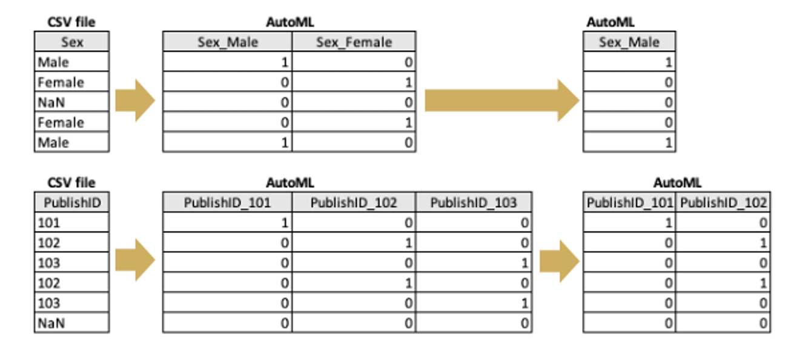
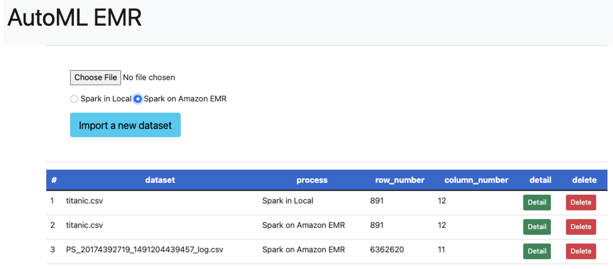
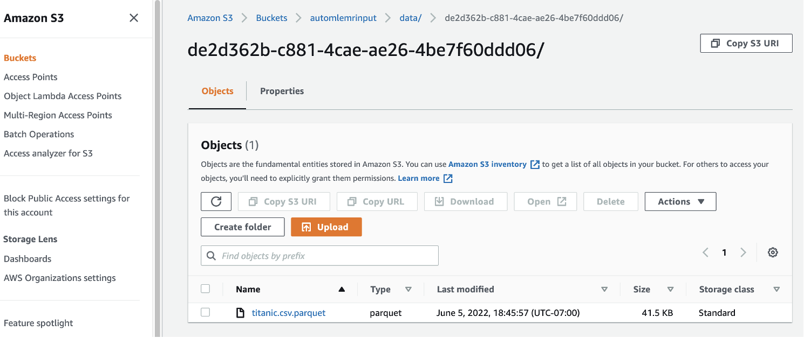

# What is AutoML?
* The lack of comparison views for the output metrics that are generated by multiple machine learning (ML) models renders the determination of insights from datasets difficult for users. 
Generating ML models also requires iterative processes, covering the understanding of data to the tuning of model parameters.

* AutoML EMR implements functions and storages that can accelerate the development of ML models. 
The selection of ML modeling, the modeling process itself, the user’s input, and ML modeling output are automated. 
Users can evaluate the output metrics generated by various ML models against one another in one summary view.
Output metrics help users select the most and least successful models for a given business scenario. 

# AutoML EMR
* AutoML EMR runs AutoML functionalities in Spark on Amazon EMR. Please read the instructions in this document below.

# Why Amazon EMR?
* Scalability and flexibility:
EMR is a managed service which provides flexibility to scale your cluster up or down as your computing needs change. You can resize your cluster to add instances for peak workloads and remove instances to control costs when peak workloads subside.
* AWS integration:
EMR integrates with other AWS services to provide capabilities and functionality related to networking, storage, security, and so on, for your cluster. For example, S3 can store EMR input and output data.
* Deployment:
EMR provides a variety of ways to configure software on users cluster as well as versions. For example, AutoML EMR applies emr-6.6.0, Hadoop 3.2.1, and Spark 3.2.0. EMR uses Amazon Linux where users can install software on users’ cluster manually using the yum or pip package manager.
* Cost savings:
EMR pricing depends on the instance type and number of EC2 instances users selected. Spot or reserved instances reduce the cost.

# Output view and metrics
* Users can review their uploaded CSV files in the summary view. 
* Quality columns show them how input data look.
* After ML modeling, area under the curve (AUC), precision, recall, and accuracy values are displayed.
* For Spark in Local, SHapley Additive exPlanations (SHAP) is also generated in graph by clicking the ML model names, so that users can figire which category values impact the most in the ML modeling. SHAP is a method of explaining individual predictions. A positive SHAP value means a positive impact on prediction. In AutoML EMR, SHAP values are converted to absolute values, and displayed in a bar graph.

# Users profile
* Our target users are those who want to analyze data and have the results represented in multiple ML models.
* To run the AutoML EMR application, users should download required libraries and run Python modules (see instructions in README.md).

# Data sources
Comma-separated value (CSV) files can be uploaded for Spark in local or Spark on Amazon EMR. 
Users can test the application with 
For Spark in Local (small file samples)
* titanic.csv (https://www.kaggle.com/c/titanic/data?select=train.csv)
* heart.csv (https://www.kaggle.com/zhaoyingzhu/heartcsv?select=Heart.csv)
###
For Spark on Amazon EMR (large file sample)
* PS_20174392719_1491204439457_log.csv (https://www.kaggle.com/datasets/ealaxi/paysim1) 

A user’s uploaded files are stored in the data folder as 1.csv, 2.csv, and so on for Spark in Local or as 1.parquet, 2.parquet, and so on in S3 buckets for Spark on Amazon EMR depending on which applications you choose to run. These internal files are used for the system to proceed ML modeling.

# Variables for ML modeling
### Target variables
* The variable that AutoML EMR recommends from a list of prospects is the target (predictor) variable selected for ML modeling.

### Category variables
* As a default, AutoML EMR detects variables that cannot be used for ML modeling because they are non-numerical expressions, such as cabin (C85, C123, etc.), embarked (S, C, and Q), name (Braund, Mr. Owner Harris, etc.), sex (male and female), and ticket (AJ5 21171, 113803, etc.). ]
* In addition to default detection, the selection of more category variables is necessary. These variables should be assigned numerical expressions 1 or 0, and one of them is dropped by get_dummies function with drop_first = True.


### Unused variables 
* By default, AutoML EMR identifies variables that are inappropriate for use in ML modeling, such as those with an excessive number of missing values, too many unique values, and so on. Aside from carrying out default detection, users are required to select more unused variables on the basis of their decisions.

# App structure

```
├── data (destination to save csv)
├── images (images to refine README)
├── sample (sample data to try AutoML EMR)
├── static (HTML components)
├── templates (HTML templates)
│   └── base.html
│   └── detail.html
│   └── experiment.html
│   └── index.html
│   └── variable.html
├── automl (function sets)
│   └──automl_spark.py (support Spark on AutoML EMR)
│   └──automl.py (support Spark in Local)
│   └──stat_util.py (convert non-numerical to numerical)
├── README.md (instructions how to run AutoML EMR)
├── app.py (run web applicaitons)
├── init_db.py (create data framework for Spark on AutoM EMR and Spark in Local)
├── input.db (generated by init_db.py)
├── model.py (set Class for each model)
└── requirements.txt (lists of installed packages)
└── LICENSE
```

# Features
### Register CSV datasets via Spark in Local for small files and Spark on Amazon EMR for large files.


### Provide useful comments to check data quality (missing value, uniques, and outliers).


### Sample output with titanic.csv, default already selected string-type values. Select a value for "Target", re-select appropriate values for "Category Variables", and inappropriate values for "Unused Variables for Modeling". 


### Sample output with fraud data named PS_20174392719_1491204439457_log.csv. Large files can be ML modeling by Spark on Amazon EMR, but it takes longer times to be completed.


### If you upload files via Spark in Local, uploaded files are stored into data folder, but if you upload files via Spark on Amazon EMR, files are uploaded into S3 bucket.


### Visualize data distribution in histgram per variable, this is an example for Pclass data.


### Fit multiple ML models automatically and compare statistical scores.


### Display ML models in histgram for Spark in Local.


# Future enhancement

* Increase the number of comparable ML models
* Add functions to tune multiple parameters by grid search.

# Run AutoML EMR locally
### Set code in python3.9 virtual environment with S3 bucket setting
```
cd (go to your workfolder, i.e. automlemr)
git clone https://github.com/ykmorimoto/automl-emr.git
cd automlemr
python3.9 -m venv .
source ./bin/activate
pip3 install --upgrade pip
pip3 install -r requirements.txt

cp settings_template.py settings.py
# fill AWS_ACCESS_KEY_ID, AWS_ACCESS_KEY_ID, AWS_REGION and S3_BUCKET in the settings.py so that automl-emr app can access s3
# this access key needs to have the permission of handling the designated S3_BUCKET

python3.9 init_db.py
python3.9 app.py
```
### Run AutoML EMR locally
```
#access http://127.0.0.1:5000 via your browser
```

# Run AutoML EMR in Spark on EMR

### Build Amazon EMR Cluster

* Look at EMR setting & Demo in my presentaiton slides: https://docs.google.com/presentation/d/1doagpXgBvPBksNBslxt_LUpLSDcrlY-iU5xqiIQngpE/edit#slide=id.p1
* Select emr-6.6.0 (Hadoop 3.2.1/Spark3.2.0)
* Steps (step type == Spark application)
* EBS Root Volume 30 GiB or larger
* Edit security group of ec2@master node (5000 for Local, 18080 for Spark UI for log)

### Installation

* Update sqlite3
```
cd ~
wget https://www.sqlite.org/2021/sqlite-autoconf-3370000.tar.gz
tar xvfz sqlite-autoconf-3370000.tar.gz
cd sqlite-autoconf-3370000

./configure --prefix=/usr/local
make
sudo make install

sudo mv /usr/bin/sqlite3 /usr/bin/sqlite3_old
sudo ln -s /usr/local/bin/sqlite3 /usr/bin/sqlite3
echo export LD_LIBRARY_PATH="/usr/local/lib" >> ~/.bash_profile
source ~/.bash_profile
```

*  Install python3.9
```
cd ~
sudo yum -y groupinstall "Development Tools"
sudo yum -y install openssl-devel bzip2-devel libffi-devel
wget https://www.python.org/ftp/python/3.9.12/Python-3.9.12.tgz

tar xvf Python-3.9.12.tgz

cd Python-*/
./configure --enable-optimizations
sudo make altinstall
```

* Configure automl app
```
cd ~
git clone https://github.com/ykmorimoto/automl-emr.git
cd automl-emr
python3.9 -m venv .
source ./bin/activate
pip3 install --upgrade pip
pip3 install -r requirements.txt

cp settings_template.py settings.py
# go open IAM in AWS Management Console, go to "Users" to set a new user name with Acess Key
# using the above Access Key, fill AWS_ACCESS_KEY_ID, AWS_REGION and S3_BUCKET in the settings.py so that AutoML EMR app can access s3
# this access key needs to have the permission of handling the designated S3_BUCKET

python3.9 init_db.py
python3.9 app.py
```

* Set up port forwarding from local to remote EC2 server 
```
Open another termimal, type
ssh -i {PRIVATE_KEY}.pem -L 5000:localhost:5000 hadoop@{EMR MASTER EC2-IP}
(in my case)
yasukom@f8ffc22c5808 ~ % ssh -i .ssh/automlemr.pem -L 5000:localhost:5000 hadoop@54.187.34.129
#access http://127.0.0.1:5000 via your browser
```

* If the above connection doesn't work, then
```
Open another terminal, type
ssh -N -L 5000:localhost:5000 {PRIVATE_KEY}
Then open
http://127.0.0.1:5000/
```